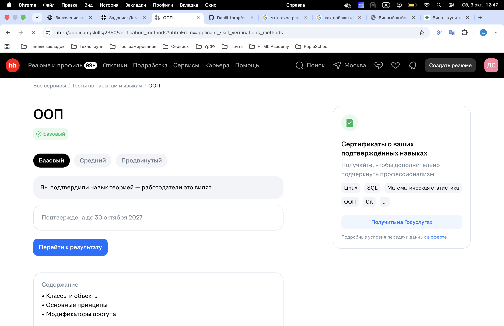
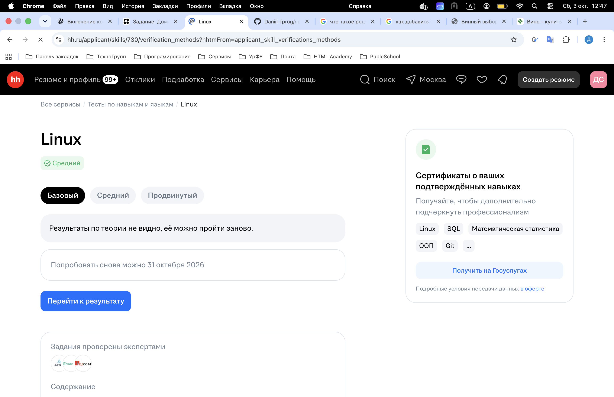
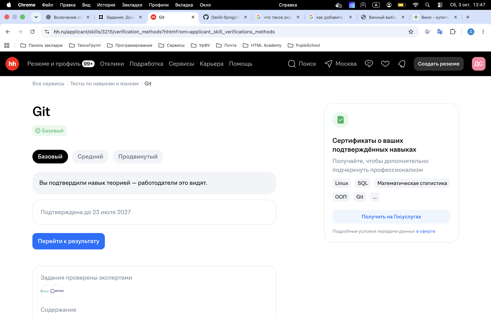
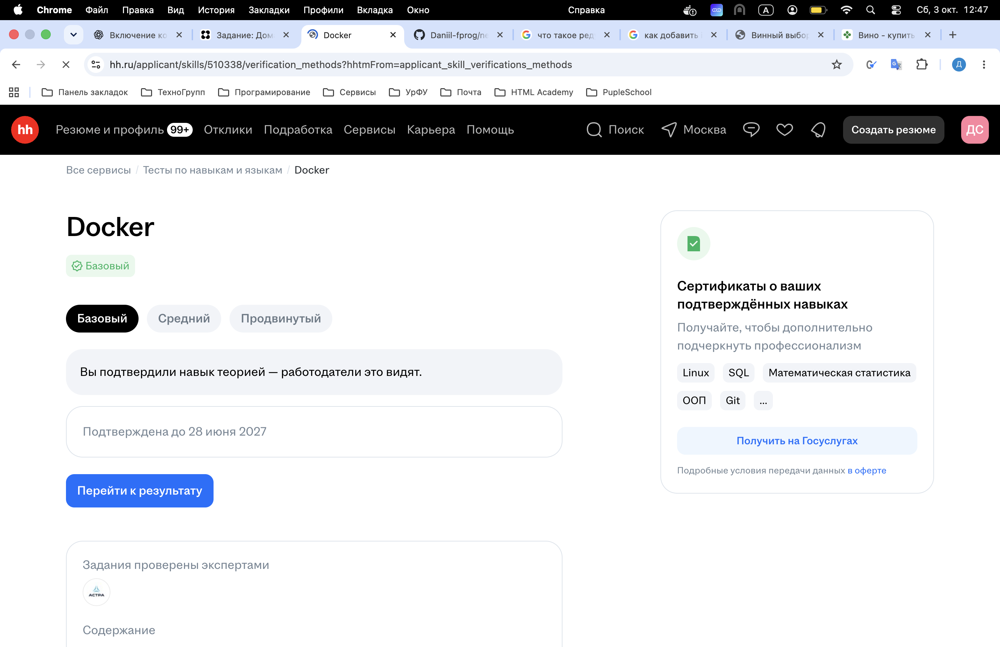
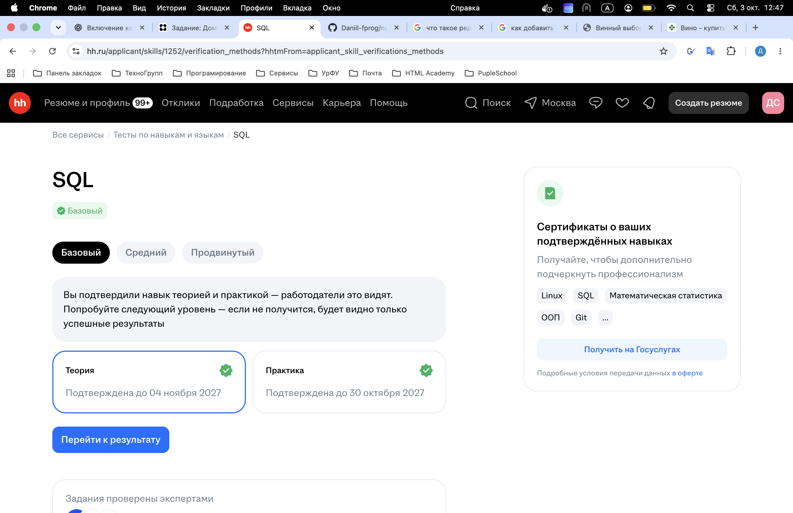
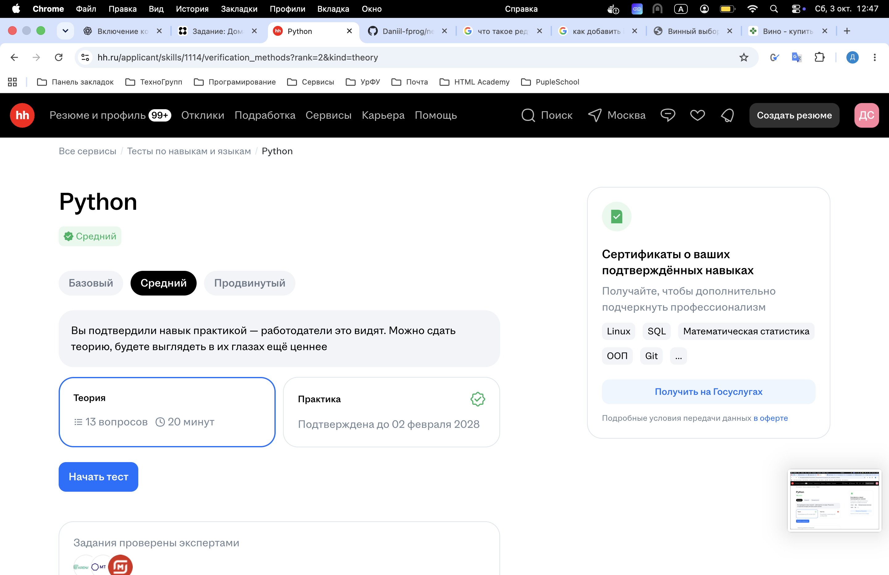

# Домашнее задание по Бизнес-применению машинного обучения

## Тесты на hh:

### Скриншот 1


### Скриншот 2


### Скриншот 3


### Скриншот 4


### Скриншот 5


### Скриншот 6



## Wine Recommendation Service

MVP-сервис подбора вина. Он разбирает запрос на русском языке, фильтрует каталог и возвращает TOP-N. Лайки сохраняются и дают небольшой бонус любимой паре `color + sugar_type`.

### Архитектура

```text
JSON source -> WineSource -> normalize -> Repository -> PostgreSQL
User query -> QueryParser -> filter -> weighted ranking -> TOP-N -> API
```

- `api` — FastAPI routes и HTTP-схемы.
- `query_parser` — rule-based parser за интерфейсом `QueryParser`.
- `recommendation` — фильтрация и ranking.
- `parser` — сменяемый `WineSource`, адаптер Перекрёстка и pipeline upsert.
- `db` — SQLAlchemy-модели и repository; `alembic` — миграции.

Ranking: `0.55 * rating + 0.25 * price_fit + 0.20 * popularity`. Веса задаются в `.env`.

### Требования

- Python 3.11+
- Poetry 2.x (`pipx install poetry`)
- PostgreSQL 16 или Docker + Docker Compose

### Быстрый запуск в Docker

```bash
cp .env.example .env
docker compose up --build
```

Веб-интерфейс: <http://localhost:8000>, Swagger UI: <http://localhost:8000/docs>. Контейнер применит миграции и запустит Uvicorn.

### Локальная установка

```bash
poetry install
cp .env.example .env
# для host-запуска заменить @db: на @localhost: в DATABASE_URL
docker compose up -d db
poetry run alembic upgrade head
poetry run uvicorn wine_recommendation.main:app --reload
```

### API

- `GET /health`
- `GET /wines`, `GET /wines/{id}`
- `POST /users`
- `POST /users/{id}/likes`, `DELETE /users/{id}/likes/{wine_id}`
- `POST /recommendations`
- `POST /parser/update`

```bash
curl -X POST http://localhost:8000/recommendations \
  -H 'Content-Type: application/json' \
  -d '{"query":"красное сухое до 1500","limit":5}'
```

### Обновление каталога

Для локальной разработки используется JSON-мок, который уже включён в проект:

```dotenv
PARSER_ENABLED=true
PEREKRESTOK_API_URL=src/wine_recommendation/data/mock_wines.json
PARSER_USER_AGENT=WineRecommendationMVP/0.1 (+your-contact@example.com)
```

Источник может быть локальным JSON-файлом либо разрешённым HTTP(S)-endpoint. Формат — JSON-массив или объект с `items`/`products`. Встроенный мок содержит 16 вин разных цветов, типов сахара и цен. Повторный запуск обновляет Wine/WineOffer; исчезнувшие из snapshot товары становятся недоступными.

```bash
docker compose run --rm api python scripts/update_parser.py
# либо при запущенном API:
curl -X POST http://localhost:8000/parser/update
```

### Качество кода

```bash
poetry run pytest
poetry run ruff check .
poetry run ruff format --check .
poetry run mypy src tests
poetry run pre-commit install
poetry run pre-commit run --all-files
```

Тесты источника читают локальную fixture и не обращаются к реальному сайту.
